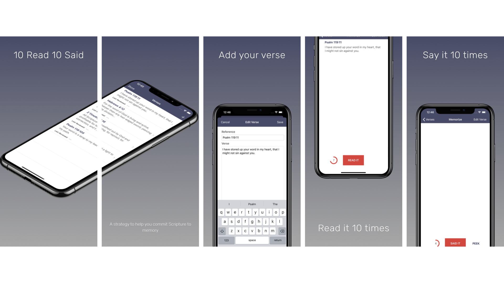
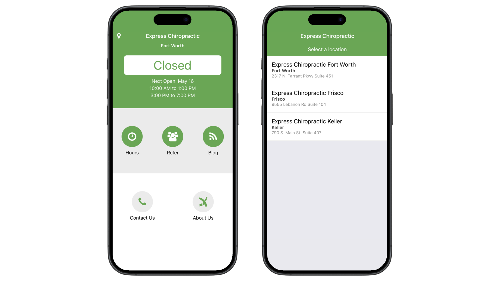

 <section class="p-5 text-center container">
  

    

        

          

            
          

      

    

</section>

<section>

    
Hi 👋🏻 I'm Andrew.
    I am a people-driven, creative, impactful teacher with more than 15 years of experience helping others succeed with technology.

    I have broad experience in web and mobile software development, data analytics, and cloud platforms, and an established record of leading the delivery of solutions to complex technology problems that advance business objectives and delight customers.
    

</section>

<main>

    

    <!-- <ul class="nav nav-pills nav-fill">
        <li class="nav-item">
            <a class="nav-link active" aria-current="page" href="#">Courses</a>
        </li>
        <li class="nav-item">
            <a class="nav-link" href="#">Apps</a>
        </li>
    </ul> -->
    <h1>Courses</h1>
        

            

                

                    
                    

                        
This course will teach you to make apps using Xcode, Swift, and SwiftUI that support the features users will expect when they upgrade to iOS 17.

                        

                            

                                <a href="https://bit.ly/ios-17-fundamentals"><button type="button" class="btn btn-sm btn-outline-secondary">View</button></a>
                            

                            <small class="text-body-secondary">Dec 7, 2023</small>
                            <small class="text-body-secondary">5h 5m</small>
                        

                    

                

            

            

                

                    
                    

                        
This course will teach you to make iOS apps with engaging user interfaces using Xcode, Swift, and SwiftUI.

                        

                            

                                <a href="https://bit.ly/building-ios-ui-swiftui"><button type="button" class="btn btn-sm btn-outline-secondary">View</button></a>
                            

                            <small class="text-body-secondary">Aug 22, 2021</small>
                            <small class="text-body-secondary">3h 16m</small> 
                        

                    

                

            

            

                

                    
                    

                        
This course will teach you to make iOS apps with adaptive user interfaces that work on multiple devices using Xcode, Swift, and SwiftUI.

                        

                            

                                <a href="https://bit.ly/iOS14-getting-started"><button type="button" class="btn btn-sm btn-outline-secondary">View</button></a>
                            

                            <small class="text-body-secondary">Dec 3, 2020</small>
                            <small class="text-body-secondary">4h 49m</small>
                        

                    

                

            

            

                

                    
                    

                        
This course will teach you how to offer digital content as in-app purchases for your iOS apps.

                        

                            

                                <a href="https://bit.ly/implementing-in-app-purchases-ios"><button type="button" class="btn btn-sm btn-outline-secondary">View</button></a>
                            

                            <small class="text-body-secondary">Jun 8, 2020</small>
                            <small class="text-body-secondary">2h 20m</small>
                        

                    

                

            

            

                

                    
                    

                        
This course will teach you how to combine problem solving skills and Xcode’s debugging tools to maximize your bug fixing potential.

                        

                            

                                <a href="https://bit.ly/ios-debugging-fundamentals"><button type="button" class="btn btn-sm btn-outline-secondary">View</button></a>
                            

                            <small class="text-body-secondary">Dec 23, 2019</small>
                            <small class="text-body-secondary">1h 25m</small>
                        

                    

                

            

            

                

                    
                    

                        
This course will teach you the big picture possibilities of data persistence on iOS, what to expect if you choose one technology over another, and get the feel for what it’s like to use popular data solutions in code.

                        

                            

                                <a href="https://bit.ly/ios-data-persistence-bp"><button type="button" class="btn btn-sm btn-outline-secondary">View</button></a>
                            

                            <small class="text-body-secondary">Dec 23, 2019</small>
                            <small class="text-body-secondary">1h 25m</small>
                        

                    

                

            

            

                

                    
                    

                        
This course will teach you the basics of using Apple’s flagship framework for remote data storage and sharing. Learn to model, save, and query data, synchronize data across devices, handle errors, and deploy to production.

                        

                            

                                <a href="https://bit.ly/cloudkit-fundamentals"><button type="button" class="btn btn-sm btn-outline-secondary">View</button></a>
                            

                            <small class="text-body-secondary">Sept 19, 2018</small>
                            <small class="text-body-secondary">3h 31m</small>
                        

                    

                

            

            

                

                    
                    

                        
This course will give you the essential skills you need to architect an app to use Core Data. You'll learn to model, manage, and display data using Core Data in this course.

                        

                            

                                <a href="https://bit.ly/ps-core-data-swift"><button type="button" class="btn btn-sm btn-outline-secondary">View</button></a>
                            

                            <small class="text-body-secondary">Mar 30, 2017</small>
                            <small class="text-body-secondary">4h 39m</small>
                        

                    

                

            

            

                

                    
                    

                        
This course will give you the essential skills you need to architect an app to use Core Data. You'll learn to model, manage, and display data using Core Data in this course.

                        

                            

                                <a href="https://bit.ly/create-cocoapod-lib"><button type="button" class="btn btn-sm btn-outline-secondary">View</button></a>
                            

                            <small class="text-body-secondary">Feb 1, 2016</small>
                            <small class="text-body-secondary">1h 39m</small>
                        

                    

                

            

        

    

    

        <h1>Apps</h1>
        

            

                

                    
                    

                    <h5 class="card-title">10 Read 10 Said</h5>
                        
More than just an app, 10 Read 10 Said is a strategy to help you commit
                            Scripture to memory. It's simple:
                            <ul>
                                <li>Choose a verse you'd like to memorize</li>
                                <li>Read the verse out loud 10 times while looking at the text</li>
                                <li>Say the verse again out loud 10 times without looking</li>
                            </ul>
                        

                        

                            <small class="text-body-secondary">Swift | SwiftUI</small>
                        

                    

                

            

            

                

                    
                    

                        <h5 class="card-title">Express Chiropractic</h5>
                        
The new Express Chiropractic app is designed to enhance the overall customer experience for our practice members. With the upgraded Express Chiropractic app you will be able to:
                            <ul>
                                <li>Check if we are currently open or closed before you head out the door</li>
                                <li>View our regular weekly scheduled hours</li>
                                <li>View any changes in schedule</li>
                                <li>Receive important announcements from Clinics related via Push Notifications</li>
                            </ul>
                        

                        

                            <small class="text-body-secondary">ReactNative, Firebase</small>
                        

                    

                

            

        

    

    

        

            

                <h1 class="modal-title fs-5" id="ten-read-ten-said-modal-label">10 Read 10 Said</h1>
                <button type="button" class="btn-close" data-bs-dismiss="modal" aria-label="Close"></button>
            

            

                
            

            

                <button type="button" class="btn btn-secondary" data-bs-dismiss="modal">Close</button>
            

        

    

    

        

            

                <h1 class="modal-title fs-5" id="express-chiropractic-modal-label">10 Read 10 Said</h1>
                <button type="button" class="btn-close" data-bs-dismiss="modal" aria-label="Close"></button>
            

            

                
            

            

                <button type="button" class="btn btn-secondary" data-bs-dismiss="modal">Close</button>
            

        

    

</main>